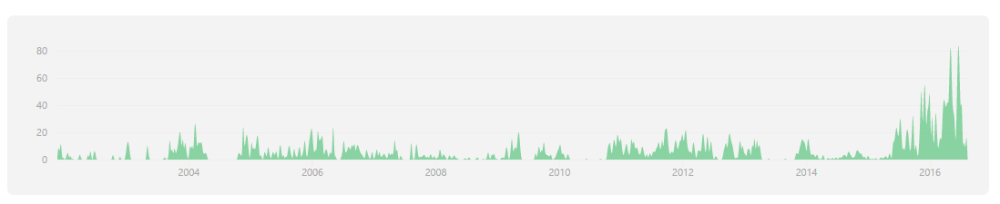
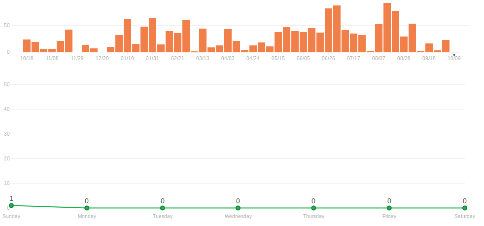

## Project Description

 

 TripleA is a turn-based strategy game and board game engine. Though TripleA comes with many games inside, it
is just an engine for playing games, and is not a game itself. TripleA started out as a World War II simulation, but
has since expanded to include different conflicts, as well as variations and mods of popular games and maps (a
‘map’ is like a board, while a ‘game’ is a specific setup on a map/board). It allows for customized user editable
maps and rules, which typically are based upon Axis and Allies rules. 

### Project History

TripleA was started in October 2001 by Sean Bridges as a way to improve his resume. However, soon after, Sean secured employment
and because of that the progress of TripleA was severely slowed. Many people made contributions, but it was not enough to keep
TripleA's development well paced, since Sean was still doing most of the development. Fortunately, two events occuring relatively
closely revitalized the project. The first was the contribution by Logan of new graphics, giving the game a better look and feel and 
the second event was the release of the revised map and rules. With no competing real time game, interest in TripleA increased.
TripleA 0.3.1 is estimated to be the first playable version in networked mode.

## Development Process

### Software Process

There's nothing in the project that says explicitly which software process was used up to this date to develop it.
However we found that it's using Travis CI. What it does is it automatically builds the project whenever a developer checks in their 
code to the repository. It also checks the pull requests and suggests if they're good or not to merge, which is basically why it's being 
used here. So with this we're assuming that the process being used, as Travis CI in the name suggests, is <b>Continuous Integration and 
Continuous Delivery</b>. <b>Continuous Integration</b> is often used in open source projects and it's essentially the practice of merging 
all working copies of a project into a commonly called master branch. This also requires developers to submit code several times a day. 
<b>Continuous Delivery</b> is closely related to <b>Continuous Integration</b> since it refers to the release of every good build of the 
software that passes the automated tests.

### Stage Of Development

TripleA, a board game engine has thousands of commits(6568) and many contributiors(12), but not always has been like this.
When it all started, in 2002 there was just a few number of contributions to the plataform. 
By the past of the years, the number of commits increased and in 2016 as it is expected the number of total contributions is huge.

The majority of contributions are new features added to the plataform and bugs-fixed.

## Critical Analysis

As an open source project, <b> Continous Integration and Continuous Delivery</b> is one of the best models
to apply. With this model, the developers release the newer features to the public as soon as they are 
ready and receive imediate feedback.

There's many advantages to this type of approach. First, the small increments make it easier for
customers to get familiar with the newer features. Second, the developers get early feedback about possible bugs or 
even new suggestions for possible new features. Third, the cost of accommodating changing customer requirements is reduced. Finally, 
the project as a lower risk of overall failure.

However, there's some disadvantages to this model. Taking into account all the feedback provided by customers,
it becomes hard to focus on a single milestone. The team is required to be well organized to be able to keep developing 
the project and, at the same time, listen to all of the public's feedback. Also, the structure of the software tends to deteriorate 
over time as new increments are added. Time and money has to be spent on refactoring to improve the software in order to keep 
the cost of implementing new features low.

## External Links
* HomePage: http://triplea-game.github.io/
* Community Website: http://www.tripleawarclub.org/
* Community Maps Repository: http://github.com/triplea-maps
* Source Forge (legacy): https://sourceforge.net/projects/triplea/
* Bug reports, feature requests: http://github.com/triplea-game/triplea/issues/new

## Group Information

* [Diogo Luís Cerqueira Carneiro da Silva](https://github.com/pingudiogo) (up201405742@fe.up.pt) 
* [Mónica Ariana Fernandes](https://github.com/arianafernandes) (up201404789@fe.up.pt) 
* [Tiago Bernardes Almeida](https://github.com/tiagobalm) (up201305665@fe.up.pt) 
