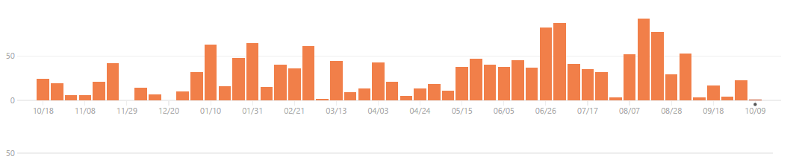
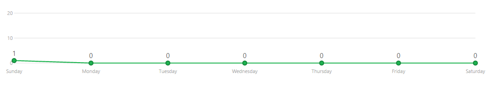

   
TripleA is a turn-based strategy game and board game engine. Though TripleA comes with many games inside, it
is just an engine for playing games, and is not a game itself. TripleA started out as a World War II simulation, but
has since expanded to include different conflicts, as well as variations and mods of popular games and maps (a
‘map’ is like a board, while a ‘game’ is a specific setup on a map/board). It allows for customized user editable
maps and rules, which typically are based upon Axis and Allies rules.
 
 
 

## Project History
TripleA was started in October 2001 by Sean Bridges as a way to improve his resume. However, soon after, Sean secured employment
and because of that the progress of TripleA was severely slowed. Many people made contributions, but it was not enough to keep
TripleA's development well paced, since Sean was still doing most of the development. Fortunately, two events occuring relatively
closely revitalized the project. The first was the contribution by Logan of new graphics, giving the game a better look and feel and 
the second event was the release of the revised map and rules. With no competing real time game, interest in TripleA increased.
TripleA 0.3.1 is estimated to be the first playable version in networked mode.

#### Process
 

As we can see by the graph, the number of commits increased as the years past. 
The year of 2016 is the year with a higher number of commits

 

 

Last week there is only one contribuition as we can see in the graph but we can also see that
in june and july was a period of high contributions for the project.

### Critical Analysis

### Work by:

Diogo Silva  
Mónica Ariana Fernandes up201404789@fe.up.pt 
Tiago Bernardes Almeida up201305665@fe.up.pt 
