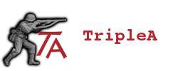
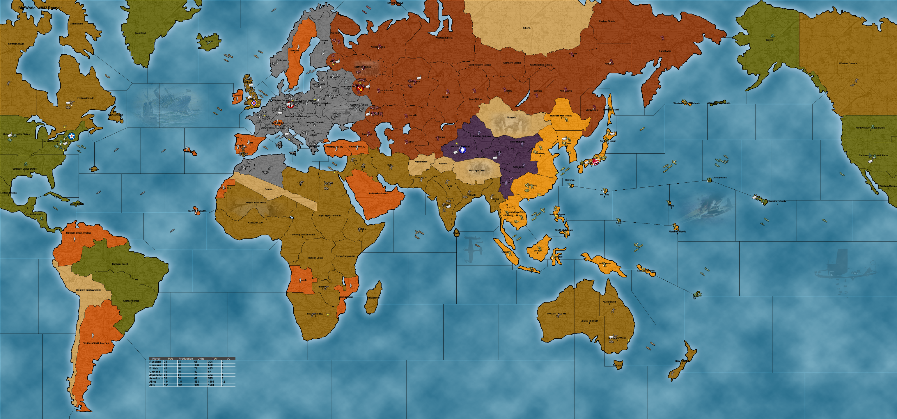

 
TripleA is a turn-based strategy game and board game engine. Though TripleA comes with many games inside, it
is just an engine for playing games, and is not a game itself. TripleA started out as a World War II simulation, but
has since expanded to include different conflicts, as well as variations and mods of popular games and maps (a
‘map’ is like a board, while a ‘game’ is a specific setup on a map/board).
 
 
 