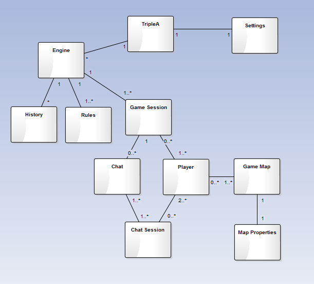

## Introduction

The major goals of the software development’s life cycle and the project as a whole are the quality and consistency of the requirement elicitation. It's all about preventing early misunderstood in the project that would otherwise lead to unnecessary expenses and a waste of time and resources due to the going back and forth in the project.
Requirements engineer (RE) is used to translate incomplete /imprecise needs or wishes of potential users and costumers into structured and realistic goals for the project.
The requirements can be divided in two main types:
Functional, if they represent a capability that the software must perform;
Nonfunctional, if they are more focused in the constrains of the solution;
Another taxonomy of the requirements is related to their level of application: business, user, system and software requirements.
The main goal of this assignment is to study the process of requirement elicitation in a specific project: TripleA. 

In the following sections, it will be presented the use cases and the requirements and features of TripleA. In the last section, it will be presented and discussed the domain model of the project.

## Description
Relying on a community willing to participate in improving TripleA, it would become very hard to manage the project without well-defined elicitation techniques. Notwithstanding, it’s obviously not mandatory for the stakeholders to participate in the requirement elicitation process, due to the "open source" development style of the project, it's very natural to engage. 
There is a section explaining the details of all contributions and the levels that can be done, using a tag system. The issues can be divided in three groups: discussion, feature, bug, infra/code.
All the stakeholders can contribute on the process of requirements elicitation. This process involves a few steps: proposal, discussion inside the community, establish its priority and ,finally, the decision about the implementation. We can find some examples of this process here (link). 

## Use Cases

* Table

* Diagram

## Requirements and Features

 As we explained in better detail in the last report, TripleA was started by 
Sean Bridges who was looking for a way to build up his resume after the end of the tech bubble. 
With the information provided, there's no way of knowing what the requirements were or even if there were any.
It is possible that this project started as a one man's simple idea and later evolved into something much bigger.

 However, we do know the project's features, thus we think is safe to assume that these were 
considered requirements: 

### Functional Requirements

* The user must be able to save at any moment.
* The user must be able to find, join and observe live games on a online lobby.
* The user must be able to play by correspondence (email).
* The user must be able to play by LAN (email).
* The user must be able to play single player against an AI.
* The community created maps should be available for in-game download.
* The engine should allow users to build their own maps and mods.

### Non-Functional Requirements

* Free to play, 100% open source and community supported
* Game rules must be based upon Axis and Allies rules.

## Domain Model

## External Links
* HomePage: http://triplea-game.github.io/
* Community Website: http://www.tripleawarclub.org/
* Community Maps Repository: http://github.com/triplea-maps
* Source Forge (legacy): https://sourceforge.net/projects/triplea/
* Bug reports, feature requests: http://github.com/triplea-game/triplea/issues/new

## Group Information

* [Diogo Luís Cerqueira Carneiro da Silva](https://github.com/pingudiogo) (up201405742@fe.up.pt) - 25% 
* [Luís Soares](https://github.com/LuiSoares) () - 25% 
* [Mónica Ariana Fernandes](https://github.com/arianafernandes) (up201404789@fe.up.pt) - 25% 
* [Tiago Bernardes Almeida](https://github.com/tiagobalm) (up201305665@fe.up.pt) - 25% 

