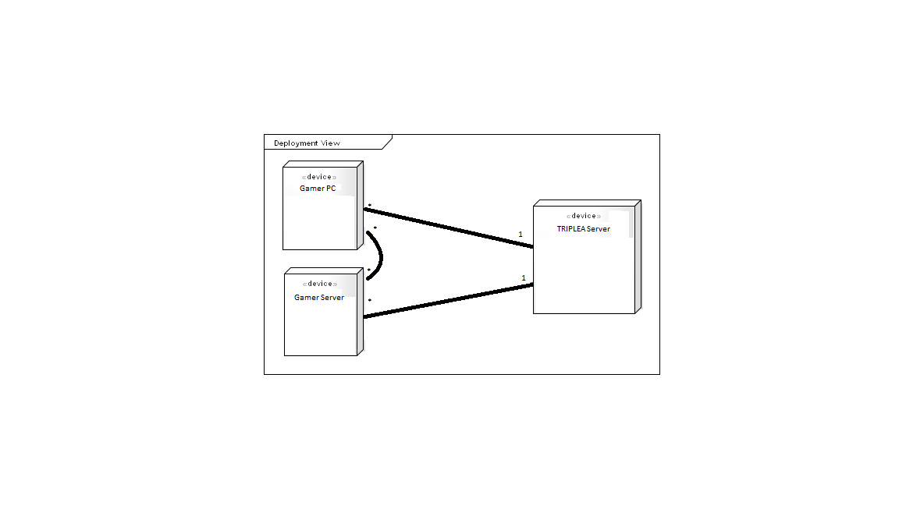

## Introduction

 Software Architecture is the fundamental organization of a system and it includes the most important decisions about it. 
This model is based ono four components: Logical View, represented by the packages diagram, Implementation View, represented 
by components diagram, Process View, represented by the activity diagram and Deployment View, represented by the deployment 
diagram. With these diagrams it's possible to analyse the evolution and the development of the project. 

 In this case, after a deep analysis of the available code and it's structure we can conclude that there is no definided 
architecture. 

## Logical View

## Development View

 The development view, also known as implementation view, illustrates a system from a programmer's perspective. With the help of a component
diagram it allows us to understand the main components of the system and how they're wired together to form larger ones. 

## Deployment View

 As the name suggests, the deployment view describes the environment into wich the system will be deployed.
This view focuses on the environment of the system, including the hardware and technical environment required as well as the mapping of the software elements to 
the runtime that will execute them. To represent this view we used a [deployment diagram](http://www.conceptdraw.com/examples/deployment-diagram). 

We only considered the existence of 3 nodes and only pointed the type of physical connection:

Gamer Server ->In case the user wants to alocate the game in his computer he becames the server. 

Gamer PC -> The user that will only connect to the TripleA server or Gamer Server.

TripleA Server -> The tripleA Server where the game is stored and other info related to user account, backup games, etc.

## Process View

 This view shows the different processes and their interaction in runtime. Since the code of this project is to extensive,
 we decided to simplify the activity diagram. We only show the most important processes for online play in a lobby and for 
 offline play. 

