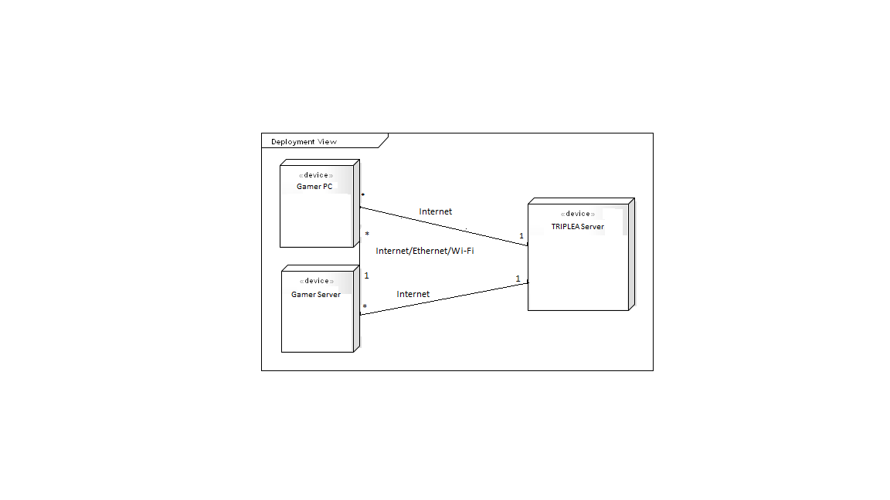

## Introduction

## Logical View

## Development View

## Deployment View

AS the name suggests, the deployment view describes the environment into wich the system will be deployed.
This view focus on the environment of the system, including the hardware and technical environment required as well as the mapping of the software elements to the runtime that will execute them. To represent this view we used a [deployment diagram](https://en.wikipedia.org/wiki/Deployment_diagram) .

We only considered the existence of 3 nodes, the gamers PC, the gamer server and the tripleA server though the gamer server is only considered when the gamer use is computer to alocate the game.

## Process View
