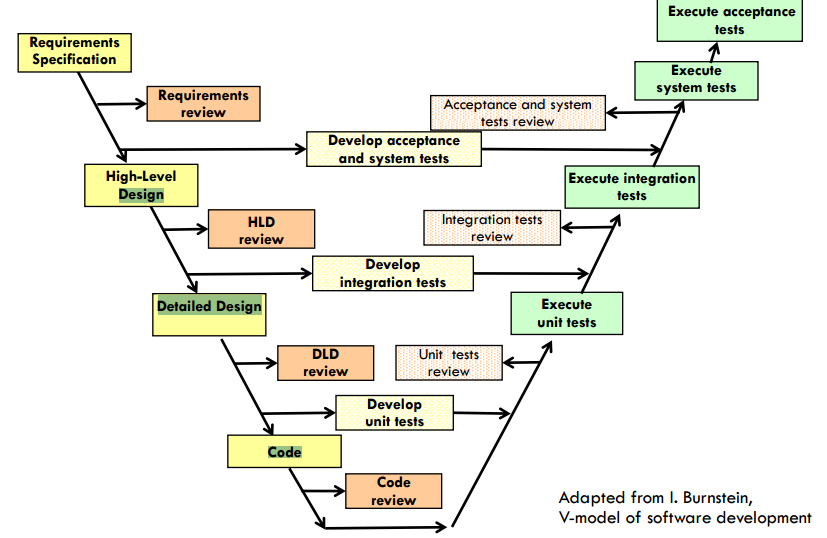
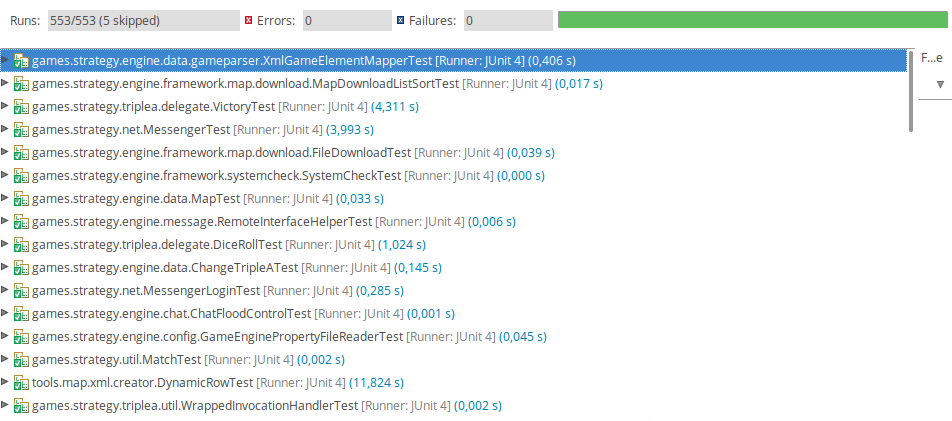
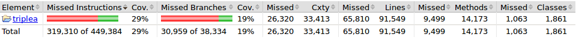

# Verification and Validation

## Introduction

 Nowadays, leaks in the control of the products quality can have huge unexpected results and, without very strict and systematic testing, it´s very easy to make them.
In average, even for an experienced programmer, it´s likely to inject around 100 defects/KLOC (Klines of code)*,  so the software testing is fundamental to the development of every product in order to detect and correct its errors and failures. 
The goal of this report is to analyses the verification and validation(V&V) process followed in the development of TripleA.
 We will approach this by describing some new concepts that concern to the software testability, in relation to the actual TripleA system and then present some relevant test statistic . 
Finally, we will select a bug that we had identify and correct it, though we tried to pull request it, we are steal waiting the admin approval.

*(Source: Inspiring, enabling and driving the Evolution of Quality at Adobe leveraging
the TSP, Jim Sartain, Senior Director, Quality, TSP Symposium 2009)

 

## Software Testability 

Software testability is a property that indicates the level of testability that a particular software supports. The higher the test capacity, the easier system failures are detected.
Regarding testability, we ought to assume that TripleA isn’t actually good. Due to its open source and modulus independence situation it´s very hard to control the quality of the test, besides, like in other games, it relies on human interaction so the product user interface is makes it a challenging area to increase testability. 
It is also important to remind that ,notwithstanding, all the testing we can do to TripleA doesn’t ensure the software is free of errors.

### Controllability

Phase where is possible to control the state of the component to be tested (CUT) in accordance with the test.
POR COMPLETAR

### Observability

Phase in which is possible to analyze the intermediate and final results of the tests.
POR COMPLETAR

### Isolability

Isolability represents the amount of each component (CUT) that can be tested isolated. 
In TripleA the components communicate with each other, so is  very difficult to isolate one component from the rest. The component under test (CUT) can only be tested in isolation, partially.

### Separation of Concerns

 Separation of concerns is the state in which the component to be tested has a unique responsibility which is well defined.

The TripleA has a well-defined concept division. The project is divided in 2 main packages. This division is very important because is the simplest way of avoiding repetition of code and creation of code that is of no use. This code structure method avoids introducing more bugs into the software.

### Understandability

 Phase in which the component to be tested is well documented and explainable by itself.
Projects such as TripleA have a large number of contributors so it is necessary for all contributors to follow a certain behavior in order to make the project more consistent and accurate.

### Heterogeneity

 Phase where it requires the use of several test methods and tools in parallel.

## Test Statistics

The statistics result of representative test cases to estimate a value of a quality metric of software.
They determine the efficiency and the reliability of the system.<

As we can see, all the tests run were either successfully executed or skipped. This doesn't prove the 
code quality is good, but it does prove that whatever the developers were testing, it executed as expected. Since this is 
a game platform with games included, it's extremely difficult to test every single scenario, due to the complexity of the 
project, so we can't say the project is prepared for every situation, however it can be said it's prepared for a good variety 
of them.

### Code Coverage

As we can see in the image above, this project does not have a good code coverage. It is important to 
notice that, being this project a game platform, a good part of the code is GUI development and that part of the code 
cannot be tested with JUnit tests. There are a few packages that have good code coverage, with values between 71% and 96%. 
Those packages are the ones related to the games logic, therefore they can be properly tested.

More information about the code coverage [here](https://htmlpreview.github.io/?https://raw.githubusercontent.com/arianafernandes/triplea/master/index.html).

### System Testing

As we said in the second report, this project started with a man's simple idea, so there is no evidence 
that there were any requirements at all. Till this day, the team does not have a proper development process and the developers 
specify the requirements themselves. This way, this system cannot be properly tested.

### Acceptance Testing

As we said before, in this project, the client and the developers are the same. Therefore, there is 
no need for acceptance tests in this project since it is built by the clients, in some way.

### Regression Testing

 For this type of testing, the unit tests are important again. Every time a bug fix or new feature is proposed, usually 
through pull requests, a member of the development team is responsible for testing it and verify if the new contribution 
does not compromise the features already implemented. This can be done by running unit tests. 

## Bug

Bugs isn’t something that this project lacks and we found several interesting ones in the [issues page](http://github.com/triplea-game/triplea/issues/). However, we were incapable of fixing every single one of them. Our main problem was the complexity of the game. Most of the issues we looked at had to do with the logic of the game. Since we didn’t make these mechanics ourselves we have almost no knowledge to help us fix problems related to this matter. So, we then decided to look at UI related problems. That’s when we found out that we couldn’t fix the problems we were looking at because the graphic’s API our game uses doesn’t allow us to do so. It has been stated by one of the main developers that solving these kinds of problems would only bring us another problem somewhere else. Also because of this the game’s UI components are being migrated to JavaFx and hopefully in the future these problems will cease to exist.

## External Links
* HomePage: http://triplea-game.github.io/
* Community Website: http://www.tripleawarclub.org/
* Community Maps Repository: http://github.com/triplea-maps
* Source Forge (legacy): https://sourceforge.net/projects/triplea/
* Bug reports, feature requests: http://github.com/triplea-game/triplea/issues/new

## Group Information

* [Diogo Luís Cerqueira Carneiro da Silva](https://github.com/pingudiogo) (up201405742@fe.up.pt) - 25% 
* [Luís Octávio Pais Ferreira Araújo Correia Soares](https://github.com/LuiSoares) (up201406356@fe.up.pt) - 25% 
* [Ariana Fernandes](https://github.com/arianafernandes) (up201404789@fe.up.pt) - 25% 
* [Tiago Bernardes Almeida](https://github.com/tiagobalm) (up201305665@fe.up.pt) - 25% 

