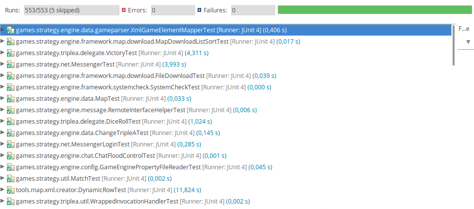

Verification and Validation

* Intro 6pts

## Test Statistics

 The statistics result of representative test cases to estimate a value of a qualility metric of software.
They determine the efficiency and the reliability of the system. 

* Bug/defect -> fix  6pts
      make pull request (code standar + tests)

## External Links
* HomePage: http://triplea-game.github.io/
* Community Website: http://www.tripleawarclub.org/
* Community Maps Repository: http://github.com/triplea-maps
* Source Forge (legacy): https://sourceforge.net/projects/triplea/
* Bug reports, feature requests: http://github.com/triplea-game/triplea/issues/new

## Group Information

* [Diogo Luís Cerqueira Carneiro da Silva](https://github.com/pingudiogo) (up201405742@fe.up.pt) - 25% 
* [Luís Octávio Pais Ferreira Araújo Correia Soares](https://github.com/LuiSoares) (up201406356@fe.up.pt) - 25% 
* [Mónica Ariana Fernandes](https://github.com/arianafernandes) (up201404789@fe.up.pt) - 25% 
* [Tiago Bernardes Almeida](https://github.com/tiagobalm) (up201305665@fe.up.pt) - 25% 