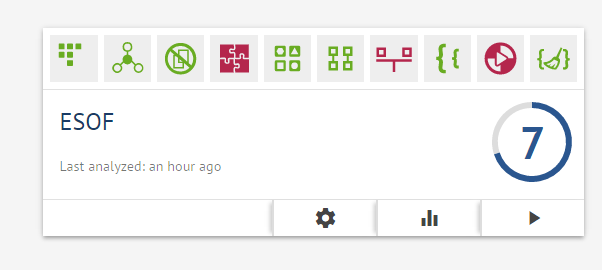
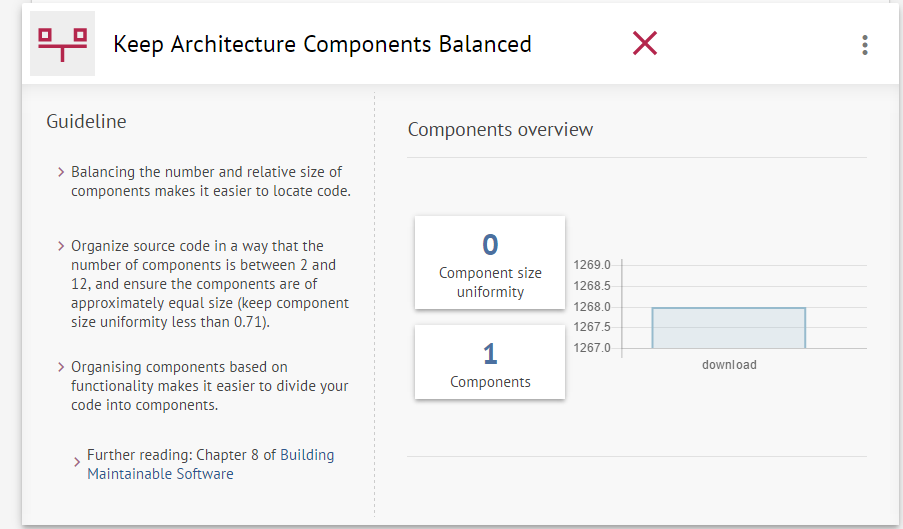

## Software Maintainability

Every project needs to be optimized and improved periodically. That's what software maintenance and evolution is about, the process of improving and optimizing a project that is already built or is being built. This is a big part of a project's development since it focuses on parts such as error handling, feature improvement, compatibility with a possible change in the user's requirements and possibly many more. Since this is an open project, the development team is the one that focuses on these topics but it is common to see a company hiring another team to fully test the code and help the developers see what they need to evolve or maintain. This can be a very expensive procedure, but since this is an open source project, there are no additional costs.

The quality of TripleA was tested with the [Better Code Hub](https://bettercodehub.com/) tool. This tool has 10 metrics to calculate readability, maintainability and evolution capacity.

After the tool was run on a small part of our project, TripleA got very good result: 7 approval and only 3 disapprovals.

 As we can see in the image above, this part of the project failed in the automated tests. We do want to say that this result is almost certainly inaccurate. Due to its size, we were unable to test the whole project in the better code hub tool, therefore it was suggested to us that we only tested a small part of the project. We created this repository with only the code we thought would be necessary to change the feature and only tested this small part.

TripleA did not pass the Unit Interfaces test. To improve this, the team must reduce the number of arguments in each function build smaller but important functions that together do the same.

## Evolution process

## External Links
* HomePage: http://triplea-game.github.io/
* Community Website: http://www.tripleawarclub.org/
* Community Maps Repository: http://github.com/triplea-maps
* Source Forge (legacy): https://sourceforge.net/projects/triplea/
* Bug reports, feature requests: http://github.com/triplea-game/triplea/issues/new

## Group Information

* [Diogo Luís Cerqueira Carneiro da Silva](https://github.com/pingudiogo) (up201405742@fe.up.pt) -  
* [Luís Octávio Pais Ferreira Araújo Correia Soares](https://github.com/LuiSoares) (up201406356@fe.up.pt) -  
* [Ariana Fernandes](https://github.com/arianafernandes) (up201404789@fe.up.pt) -  
* [Tiago Bernardes Almeida](https://github.com/tiagobalm) (up201305665@fe.up.pt) -  
